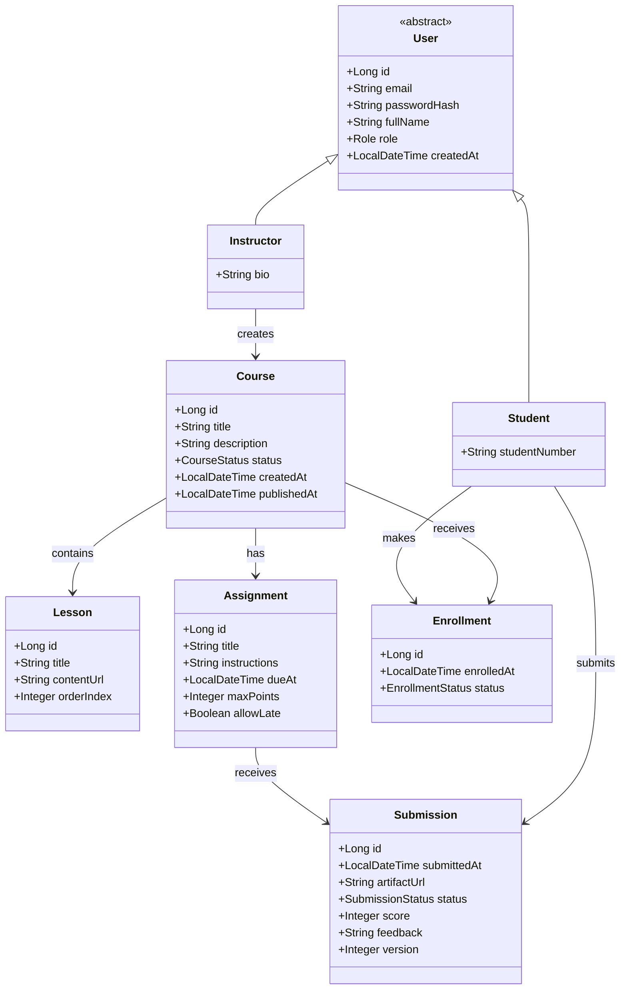

# IronLMS

## Description of the Project

**IronLMS** is a comprehensive Learning Management System (LMS) backend built with modern Java technologies. This project serves as a robust educational platform that enables instructors to create and manage courses while allowing students to enroll, access content, and submit assignments.

### Key Features

- **User Management**: Role-based authentication with JWT tokens supporting Students, Instructors, and Admins
- **Course Management**: Complete course lifecycle from draft to published status with lessons and assignments
- **Enrollment System**: Self-service student enrollment with status tracking
- **Assignment System**: Student submission handling with instructor grading capabilities
- **Security**: JWT-based authentication with role-based authorization
- **API Documentation**: Comprehensive Swagger/OpenAPI documentation
- **Testing**: Extensive test coverage (≥80%) with unit and integration tests
- **Database Management**: Flyway migrations for version-controlled database schema

### Project Goals

This LMS demonstrates clean architecture principles, RESTful API design, JPA inheritance patterns, and modern Spring Boot practices. It showcases enterprise-level features including proper error handling, validation, security, and comprehensive testing strategies.

---

## Class Diagram

The system follows a well-structured domain model with clear relationships between entities:



### Entity Relationships

- **User** is an abstract base class with **Student** and **Instructor** as concrete implementations
- **Instructors** can create multiple **Courses**
- **Courses** contain multiple **Lessons** and **Assignments**
- **Students** can enroll in **Courses** through **Enrollments**
- **Students** can submit **Submissions** for **Assignments**

---

## Setup

### Prerequisites

Before running the application, ensure you have the following installed:

- **Java 17** or higher
- **Maven 3.6+** (or use the included Maven Wrapper)
- **MySQL 8.0** or higher
- **Git** for version control

### Database Setup

1. **Install MySQL 8.0** and start the service
2. **Create a database** for the LMS:
   ```sql
   CREATE DATABASE lms;
   ```
3. **Update database configuration** in `src/main/resources/application.properties`:
   ```properties
   spring.datasource.url=jdbc:mysql://localhost:3306/lms?createDatabaseIfNotExist=true&useSSL=false&allowPublicKeyRetrieval=true&serverTimezone=UTC
   spring.datasource.username=your_username
   spring.datasource.password=your_password
   ```

### Application Setup

1. **Clone the repository**:
   ```bash
   git clone <repository-url>
   cd IronLMS
   ```

2. **Build the project**:
   ```bash
   # Using Maven Wrapper (recommended)
   ./mvnw clean install
   
   # Or using Maven directly
   mvn clean install
   ```

3. **Run the application**:
   ```bash
   # Using Maven Wrapper
   ./mvnw spring-boot:run
   
   # Or using Maven
   mvn spring-boot:run
   ```

4. **Verify the setup**:
   - Application will start on `http://localhost:3315`
   - API documentation available at `http://localhost:3315/swagger-ui.html`
   - Health check available at `http://localhost:3315/actuator/health`

### Demo Accounts

The application comes with pre-seeded demo accounts for testing:

- **Instructor**: `instructor@lms.local` / `password`
- **Student**: `student@lms.local` / `password`

### Running Tests

```bash
# Run all tests
./mvnw test

# Run tests with coverage report
./mvnw test jacoco:report

# View coverage report
open target/site/jacoco/index.html
```

---

## Technologies Used

### Core Framework
- **Java 17** - Programming language
- **Spring Boot 3.5.5** - Application framework
- **Spring Web** - REST API development
- **Spring Data JPA** - Data persistence layer
- **Spring Security** - Authentication and authorization

### Database & Migration
- **MySQL 8.0** - Primary database
- **H2** - In-memory database for testing
- **Flyway** - Database migration management
- **Hibernate** - ORM framework

### Security & Authentication
- **JWT (JSON Web Tokens)** - Stateless authentication
- **JJWT 0.12.5** - JWT implementation
- **BCrypt** - Password hashing

### API Documentation
- **Springdoc OpenAPI 2.8.11** - API documentation
- **Swagger UI** - Interactive API explorer

### Validation & Utilities
- **Jakarta Bean Validation** - Input validation
- **Lombok** - Code generation and boilerplate reduction

### Testing
- **JUnit 5** - Unit testing framework
- **Mockito** - Mocking framework
- **Spring Boot Test** - Integration testing
- **JaCoCo 0.8.12** - Code coverage analysis

### Build & Development
- **Maven** - Dependency management and build tool
- **Maven Wrapper** - Consistent build environment

---

## Controllers and Routes Structure

### Authentication Controller (`/auth`)

| Method | Endpoint | Description | Access |
|--------|----------|-------------|---------|
| POST | `/auth/login` | User authentication | Public |

**Request Body:**
```json
{
  "email": "user@example.com",
  "password": "password"
}
```

**Response:**
```json
{
  "token": "eyJhbGciOiJIUzI1NiIsInR5cCI6IkpXVCJ9...",
  "user": {
    "id": 1,
    "email": "user@example.com",
    "fullName": "John Doe",
    "role": "STUDENT"
  }
}
```

### Course Controller (`/api/courses`)

| Method | Endpoint | Description | Access |
|--------|----------|-------------|---------|
| GET | `/api/courses` | List published courses | Public |
| GET | `/api/courses/{id}` | Get course details | Public/Instructor |
| POST | `/api/courses` | Create new course | Instructor/Admin |
| PUT | `/api/courses/{id}` | Update course | Instructor/Admin |
| DELETE | `/api/courses/{id}` | Delete course | Instructor/Admin |

### Lesson Controller (`/api/courses/{id}/lessons`)

| Method | Endpoint | Description | Access |
|--------|----------|-------------|---------|
| GET | `/api/courses/{id}/lessons` | List course lessons | Public |
| POST | `/api/courses/{id}/lessons` | Create lesson | Instructor/Admin |
| PUT | `/api/courses/{id}/lessons/{lessonId}` | Update lesson | Instructor/Admin |
| DELETE | `/api/courses/{id}/lessons/{lessonId}` | Delete lesson | Instructor/Admin |

### Assignment Controller (`/api/courses/{id}/assignments`)

| Method | Endpoint | Description | Access |
|--------|----------|-------------|---------|
| GET | `/api/courses/{id}/assignments` | List course assignments | Public |
| POST | `/api/courses/{id}/assignments` | Create assignment | Instructor/Admin |
| PUT | `/api/courses/{id}/assignments/{assignmentId}` | Update assignment | Instructor/Admin |
| DELETE | `/api/courses/{id}/assignments/{assignmentId}` | Delete assignment | Instructor/Admin |

### Enrollment Controller (`/api/enrollments`)

| Method | Endpoint | Description | Access |
|--------|----------|-------------|---------|
| POST | `/api/courses/{id}/enroll` | Enroll in course | Student |
| GET | `/api/enrollments` | List user enrollments | Student/Instructor |

### Submission Controller (`/api/submissions`)

| Method | Endpoint | Description | Access |
|--------|----------|-------------|---------|
| POST | `/api/assignments/{id}/submissions` | Submit assignment | Student |
| GET | `/api/submissions/mine` | List user submissions | Student |
| PATCH | `/api/submissions/{id}/grade` | Grade submission | Instructor/Admin |

### Utility Controllers

| Method | Endpoint | Description | Access |
|--------|----------|-------------|---------|
| GET | `/api/me` | Get current user profile | Authenticated |
| GET | `/actuator/health` | Health check | Public |

---

## Extra Links

### Project Management
- **Management**: [Jira Board](https://ironlms.atlassian.net/jira/software/projects/IRON/boards/3?atlOrigin=eyJpIjoiYjFhM2VhZWUwYzBiNDA5Njk4ZGJlY2RlMGEzOTkxODUiLCJwIjoiaiJ9)

### Documentation
- **API Documentation**: http://localhost:3315/swagger-ui.html
- **Postman Collection**: `docs/postman/IronLMS.postman_collection.json`
- **Class Diagram**: `docs/uml/lms-class-diagram.puml`

### Presentations
- **Project Presentation Slides**: [Google Slides](https://docs.google.com/presentation/d/e/2PACX-1vQtf1T7RQm2Qsm-2z8f-f3zabUNJjxhmFwnhHQ58ueSoIQlcsDW_rKsV5vDxooLcBht7q_CCaw9rU7w/pub?start=false&loop=false&delayms=3000)

### Development Resources
- **Code Coverage Report**: `target/site/jacoco/index.html`
- **Test Reports**: `target/surefire-reports/`
- **Build Artifacts**: `target/`

---

## Future Work

### Phase 1: Enhanced Features
- **File Upload System**: Implement S3/GCS integration for rich content submissions
- **Real-time Notifications**: WebSocket support for live updates
- **Advanced Search**: Full-text search across courses and content
- **Mobile API**: Optimized endpoints for mobile applications

### Phase 2: Analytics & Reporting
- **Instructor Dashboards**: Comprehensive analytics for course performance
- **Student Progress Tracking**: Detailed learning analytics
- **Grade Book**: Advanced grading and reporting features
- **Export Capabilities**: PDF/Excel export for reports

### Phase 3: Scalability & Performance
- **Caching Layer**: Redis integration for improved performance
- **Rate Limiting**: API rate limiting and throttling
- **Microservices**: Break down into microservices architecture
- **Load Balancing**: Support for horizontal scaling

### Phase 4: Advanced Features
- **Soft Delete**: Implement soft delete with audit trails using Hibernate Envers
- **API Versioning**: Support for multiple API versions
- **Webhook System**: Event-driven architecture with webhooks
- **Multi-tenancy**: Support for multiple organizations

### Phase 5: Integration & Extensions
- **SSO Integration**: SAML/OAuth2 integration
- **LTI Support**: Learning Tools Interoperability compliance
- **Calendar Integration**: Google Calendar/Outlook integration
- **Third-party Tools**: Integration with external educational tools

---

## Resources

### Official Documentation
- [Spring Boot Documentation](https://spring.io/projects/spring-boot)
- [Spring Security Reference](https://docs.spring.io/spring-security/reference/)
- [Spring Data JPA Documentation](https://docs.spring.io/spring-data/jpa/docs/current/reference/html/)
- [MySQL Documentation](https://dev.mysql.com/doc/)

### Learning Resources
- [Spring Boot Guides](https://spring.io/guides)
- [JWT.io](https://jwt.io/) - JWT debugging and information
- [REST API Design Best Practices](https://restfulapi.net/)
- [Clean Architecture Principles](https://blog.cleancoder.com/uncle-bob/2012/08/13/the-clean-architecture.html)

### Tools & Utilities
- [Postman](https://www.postman.com/) - API testing
- [DBeaver](https://dbeaver.io/) - Database management
- [IntelliJ IDEA](https://www.jetbrains.com/idea/) - IDE
- [Mermaid Live Editor](https://mermaid.live/) - Diagram creation

### Testing Resources
- [JUnit 5 User Guide](https://junit.org/junit5/docs/current/user-guide/)
- [Mockito Documentation](https://javadoc.io/doc/org.mockito/mockito-core/latest/org/mockito/Mockito.html)
- [Spring Boot Testing](https://docs.spring.io/spring-boot/docs/current/reference/html/spring-boot-features.html#boot-features-testing)

---

## License

This project is licensed under the MIT License - see the [LICENSE](LICENSE) file for details.

## Contributing

1. Fork the repository
2. Create a feature branch (`git checkout -b feature/AmazingFeature`)
3. Commit your changes (`git commit -m 'Add some AmazingFeature'`)
4. Push to the branch (`git push origin feature/AmazingFeature`)
5. Open a Pull Request

## Acknowledgments

- Built for IronHack Module 2 Final Project
- Special thanks to the Spring Boot community for excellent documentation
- Inspired by modern LMS platforms and clean architecture principles

## Team Members

- **Ilia Iasyr** — Developer  
- **Cursor** — Used as testing assistant

